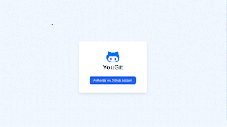

<br>
<p align=center>

<p>
<p align=center>YouGit allows you to rapidly navigate your github projects<br> and preview your commits history for different branches.</p>
<p align=center>
<a href="https://youcan.yudax.me">Live Demo</a>  | 
<a href="https://github.com/NextmediaMa/coding-challenges/tree/master/Junior%20Software%20Engineer%20-%20Frontend%20(VueJS)">Challenge Link</a>
</p>
<br>

## **Features**

<table border="0">
 <tr>
    <td></td>
    <td>⚡ Quickly find your repository<br>
📍 Fetch commits history of your selected repository
<br> ⛓️ Branch switching 
<br> ✨ Clean and minimalist user interface
<br> 👨‍💻 Developers friendly</td>
 </tr>
</table>

## **Try it Online ⚡**

[https://youcan.yudax.me](https://youcan.yudax.me)

## **Usage**

1. Install Wrangler

   ```
     npm install wrangler
   ```

2. Create a Github OAuth App

   [Guide](https://docs.github.com/en/developers/apps/building-oauth-apps/creating-an-oauth-app)

3. Copy `.dev.vars.template` to `.dev.vars` replace you `client_secret`

   ```
    CLIENT_SECRET = "***************"
   ```

4. Replace `client_id` inside `src/config/index.ts`
   ```
   clientId: ''
   ```
5. Run npm install

   ```
     npm install
   ```

6. Run dev mode
   ```
     npm run dev
   ```

## **Tech Stack**

- [Vue3](https://vuejs.org/)
- [TypeScript](https://www.typescriptlang.org/)
- [TailwindCSS](https://tailwindcss.com/)
- [Vite](https://vitejs.dev/)
- [Cloudflare Pages + Functions](https://developers.cloudflare.com/pages/platform/functions/)

## **Resources**

- [OAuth](https://docs.github.com/en/developers/apps/building-oauth-apps/creating-an-oauth-app)
- [API - user](https://docs.github.com/en/rest/users/users)
- [API - repositories](https://docs.github.com/en/rest/repos/repos#list-repositories-for-the-authenticated-user)
- [API - branches](https://docs.github.com/en/rest/branches/branches)
- [API - commits](https://docs.github.com/en/rest/commits/commits)
- [UX - Mockup](https://app.moqups.com/sZB0qKZrxH/view/page/a34175fd3)

## **CheckList**

- [x] Github OAuth implementation
- [x] Create API service
- [x] Setup app data source
- [x] Home Page
  - List repositories with filters and autocomplete
  - Commit history with infinite scroll
  - Branch switching
- [x] User Interface enhancement
- [x] Create Documentation
- [x] Test & Deployment

## **Author**

Twitter: https://twitter.com/_yudax

Email: contact@yudax.me

Website: https://yudax.me
